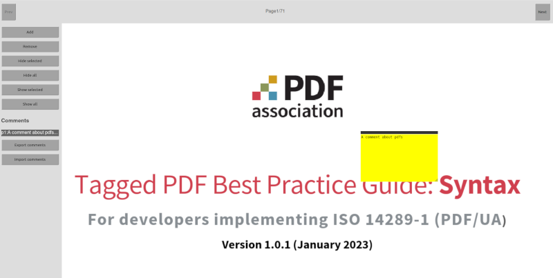

# PDF viewer Typescript no-dependencies experiment

A code experiment on creating a pdf viewer without dependencies. Not even React.
It recreates basic component concepts in plain Typescript.



## Features

The viewer allows to load a PDF and:

- Next and previous page navigation.
- Add comments (sticky notes) at coordinates and page.
- Move comments.
- Select some of the comments on the page or on a sidebar.
- Hide selected or all comments .
- Export comments as standard file.


## How to run

With Node installed, install dependencies with

```bash
npm install
```

Build and serve the project with

```bash
npm run build && npm run serve
```

This will make the project available at http://localhost:3000

## About the app and approach

We are not using any other libraries than PDF js dist to render pages as images:

### PDF js dist(https://www.npmjs.com/package/pdfjs-dist) 
This seemed to be the closest library for our usecase. It had some problems with typings, and the bundle is much bigger because of a worker option.

### No other libraries
Because no JSX/React/x was the objective of the experiment, I reimplemented a very minimal component framework from scratch.

It consists of:

- `dom.ts` to create html
- `event.ts` to act as a central state management (like redux or Elm)
- `component.ts` to implement a base component class from which all components inherit

All the low-level pdf operations and "ugly bits" are in `mypdfviewer.ts`. Once the user has uploaded a file, the general UI is managed from our custom components.

Everything works similarly to a state machine, sending well-defined events, updating the state and rerendering everything.


## Running unit tests
I focused on the event management, since the component testing would be more integration testing.

```bash
npm run test
```

## Running E2E tests
For the e2e test I have tested the adding and removing of components, including accross pages.
To run the e2e tests with playwright, run:

```bash
npm run build && npm run server
```

And in a different terminal tab:

```bash
npm run e2e
```

You can also run it with the ui to see step by step interactions

```bash
npm run e2e_ui
```

And check the report of the ran tests with

```bash
npm run e2e_report
```

## Code quality

We can run format with:

```bash
npm run format
```

typechecks with

```bash
npm run check
```

and linters with

```bash
npm run lint
```

## Documentation
[Typedoc](https://typedoc.org/) was used for documentation.
The generated docs are included in the repo, but you can
regenerate them by running:

```bash
npm run generate_docs
```


## Future improvements
### Import feature
Left out for now. We have the export only.

### Decrease bundle size (pdf js dist worker)
An option needed for the library increased the bundle size by a lot. Explore how to remove it.

### Better typing
There are a couple of `any`s still left. While `event.ts` is type safe regarding the key, it is not regarding the payload.


### Containerize for ci/cd
A Docker image to run the project would be nice to:

-  not need any specific Nodejs version
- Test new versions compatibility
- Easily run on CI/CD pipelines

### Scope in CSS
Once supported, `@scope` could be implemented in `component.ts` to not need to pass the id in the styles string.
https://github.com/mozilla/standards-positions/issues/472

```
:scope {
    background-color: #4CAF50;
    border: none;
    color: white;
    padding: 20px;
    
}
:scope:hover {
    background-color: blue;
}
```